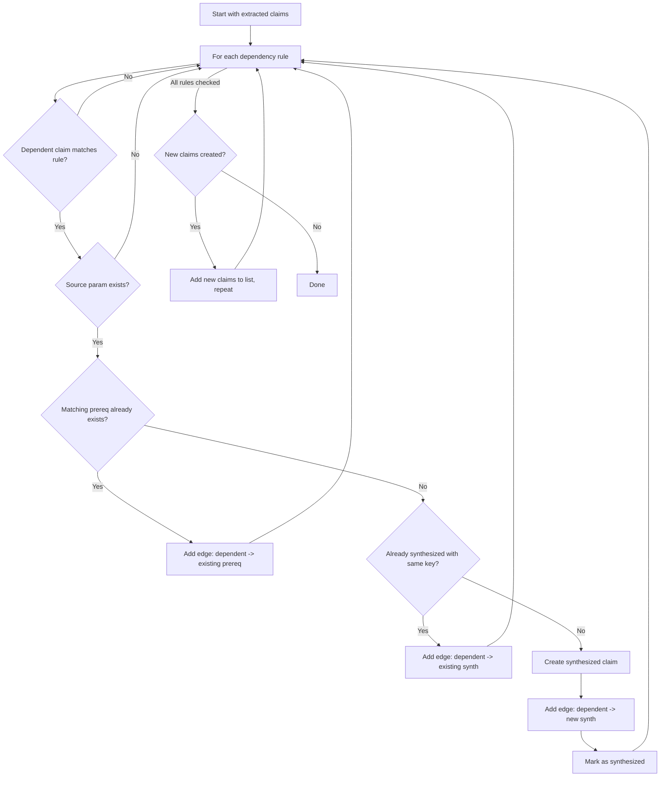
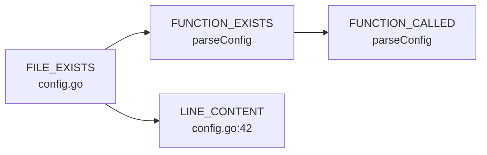
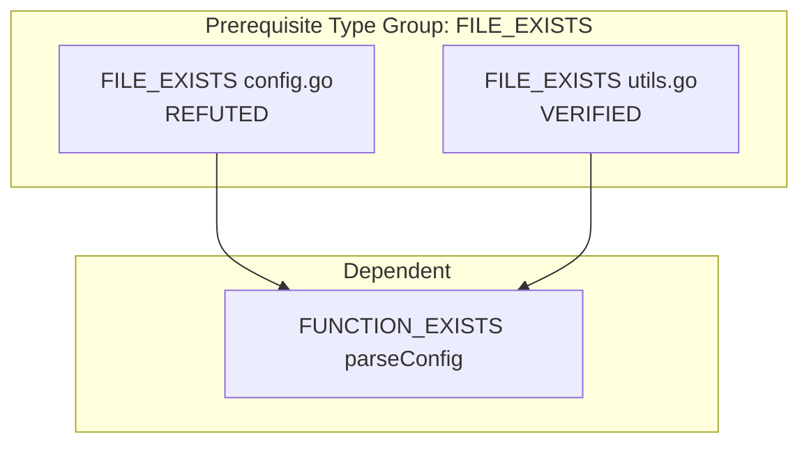

# Claim Chaining

Claim chaining is CCV's mechanism for handling dependencies between claims. When an LLM says "the function `parseConfig` is called on line 42 of `config.go`," there's an implicit dependency: the file must exist, and the function must be defined, before checking the call site. CCV makes these dependencies explicit.

## Why chaining matters

Without chaining, if the LLM claims "function X is called in file Y" and file Y doesn't exist, you get:

- FUNCTION_CALLED: REFUTED (no call sites found via grep, because grep found nothing in a nonexistent file)
- No signal about WHY it was refuted

With chaining, you get:

- FILE_EXISTS (synthesized): REFUTED (file not found)
- FUNCTION_CALLED: VERIFIED/REFUTED (from actual grep) + suspect_reason: "all FILE_EXISTS prerequisites REFUTED"

The SUSPECT flag tells you that even if the call site check technically passed (maybe the function name matched elsewhere), the result is unreliable because the prerequisite failed.

## The 7 built-in dependency rules

Each rule is a tuple: `(dependent_type, prerequisite_type, source_param, target_param)`.

| Dependent | Prerequisite | Source Param | Target Param | Meaning |
|-----------|-------------|--------------|--------------|---------|
| LINE_CONTENT | FILE_EXISTS | `path` | `path` | Before checking line content, verify the file exists |
| GENERATED_OR_VENDORED | FILE_EXISTS | `path` | `path` | Before checking generated markers, verify the file exists |
| FUNCTION_EXISTS | FILE_EXISTS | `file` | `path` | Before searching for a function def, verify its file exists |
| FUNCTION_CALLED | FUNCTION_EXISTS | `name` | `name` | Before checking call sites, verify the function is defined |
| HAS_CALLERS | FUNCTION_EXISTS | `name` | `name` | Before checking callers, verify the function is defined |
| IMPORT_EXISTS | FILE_EXISTS | `file` | `path` | Before checking imports, verify the file exists |
| MITIGATION_EXISTS | FILE_EXISTS | `file` | `path` | Before checking mitigations, verify the file exists |

## Parameter mapping

The source and target params define how the dependent claim's parameters map to the prerequisite claim's parameters.

Example: the rule `(FUNCTION_EXISTS, FILE_EXISTS, "file", "path")` means:

1. Take the `file` parameter from a `FUNCTION_EXISTS` claim
2. Use it as the `path` parameter in a synthesized `FILE_EXISTS` claim

If the LLM extracts:
```json
{"claim_type": "FUNCTION_EXISTS", "parameters": {"name": "parseConfig", "file": "config.go"}}
```

The engine synthesizes:
```json
{"claim_type": "FILE_EXISTS", "parameters": {"path": "config.go"}}
```

If the source parameter is missing from the dependent claim (e.g., `FUNCTION_EXISTS` without a `file` parameter), no prerequisite is synthesized for that rule.

## Synthesis algorithm

The `_build_dependency_graph()` method runs up to 3 rounds to handle transitive synthesis:



Key behaviors:

- **Deduplication:** synthesized claims are deduped by `(claim_type, frozen_parameters)`. If two different FUNCTION_EXISTS claims both need a FILE_EXISTS for `config.go`, only one is synthesized.
- **Transitive synthesis:** if a synthesized claim itself matches a dependency rule, its prerequisites are synthesized in the next round. Up to 3 rounds are allowed.
- **Existing claim reuse:** if the LLM already extracted a matching prerequisite, no synthesis is needed. The engine just adds an edge.

## Topological sort

After building the dependency graph, claims are sorted using Kahn's BFS algorithm so prerequisites are verified before their dependents.



In this graph, FILE_EXISTS is verified first (in-degree 0), then FUNCTION_EXISTS and LINE_CONTENT (in-degree drops to 0 after FILE_EXISTS completes), then FUNCTION_CALLED.

If there's a cycle (which the `register_dependency` check should prevent, but just in case), remaining nodes are appended in their original order.

## SUSPECT propagation

After all claims are verified, the engine runs `_propagate_suspect()` to flag dependents whose prerequisites failed.

The logic uses **ANY-match semantics within each prerequisite type**:

1. For each dependent claim, group its prerequisite claims by `claim_type`
2. For each type group, check if ALL claims of that type are REFUTED
3. If so, the dependent gets a `suspect_reason` like "all FILE_EXISTS prerequisites REFUTED"



In this example, the FUNCTION_EXISTS claim is NOT marked SUSPECT because at least one FILE_EXISTS prerequisite is VERIFIED (ANY-match). The function might be in `utils.go` even though `config.go` doesn't exist.

But if both FILE_EXISTS claims were REFUTED, the FUNCTION_EXISTS claim would get `suspect_reason = "all FILE_EXISTS prerequisites REFUTED"`.

## Impact on calibration

Suspect claims are penalized during calibration. A VERIFIED claim with a `suspect_reason` gets a 0.5 weight factor instead of 1.0. This means:

- A claim that's technically VERIFIED but has all prerequisites REFUTED contributes half as much to the confidence score
- This prevents the overall score from being inflated by claims that "passed" only because of coincidental grep matches in unrelated files

Synthesized claims are excluded from metrics entirely. They exist only to support the dependency graph. The `total_claims`, `verified`, `refuted`, and other counts in the `VerificationReport` reflect only the original extracted claims.

## Adding custom dependency rules

Use `register_dependency()` to add rules for custom claim types:

```python
verifier.register_dependency(
    claim_type="HAS_DECORATOR",
    depends_on="FUNCTION_EXISTS",
    source_param="function",
    target_param="name",
)
```

Or pass `depends_on` when registering the claim type:

```python
verifier.register(
    claim_type="HAS_DECORATOR",
    verifier_fn=my_verifier,
    extraction_hint="...",
    depends_on=[("FUNCTION_EXISTS", "function", "name")],
)
```

The engine performs cycle detection via DFS before accepting a new rule. If adding the rule would create a circular dependency chain, `register_dependency()` raises `ValueError`.
