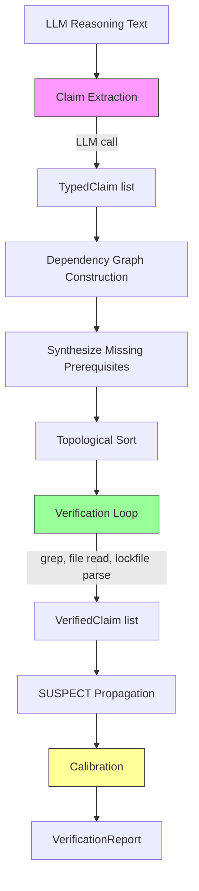
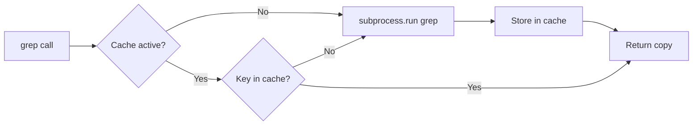

# Architecture Overview

CCV's architecture separates the one part that requires an LLM (claim extraction) from everything else (verification, which is fully deterministic). This page covers the pipeline, the key components, and how caching works.

## Pipeline



**Pink** = LLM call (only one). **Green** = deterministic verification. **Yellow** = score computation.

## Component breakdown

### Extractor (`extractor.py`)

Responsible for the single LLM call. Takes reasoning text and produces a list of `TypedClaim` objects.

The extractor sends a system prompt describing all 14 claim types (plus any custom types) and asks the LLM to output a JSON array of claims. Each claim has a `claim_type`, `parameters`, and `source_sentence`.

The prompt includes rules about what to extract and what to skip:

- Extract claims about what IS or IS NOT in the code
- Skip opinions, recommendations, quality judgments
- Skip claims about what SHOULD be done
- Each claim must be independently verifiable

For batch extraction, the system prompt is extended to handle multiple findings delimited by `<<<FINDING_N:filename>>>` markers, with each claim tagged by `finding_index`.

### VerificationEngine (`engine.py`)

The core of CCV. Owns the verifier registry, result caching, and dependency graph.

Two entry points:

- `verify_claims()`: flat verification with per-call caches (grep + verifier result)
- `verify_claims_with_chaining()`: full pipeline with dependency synthesis, topological sort, verification, and SUSPECT propagation

The engine wraps each verifier call with error handling. If a verifier throws an exception, the claim gets verdict UNVERIFIABLE with the exception details in the `error` field.

### Verifiers (`verifiers/`)

Four modules, one per category:

| Module | Claim Types | Tools Used |
|--------|-------------|------------|
| `file_claims.py` | FILE_EXISTS, LINE_CONTENT, FILE_CLASSIFICATION, GENERATED_OR_VENDORED | `os.path.isfile`, file read, regex |
| `symbol_claims.py` | FUNCTION_EXISTS, FUNCTION_CALLED, HAS_CALLERS | `grep` with language-specific patterns |
| `import_claims.py` | IMPORT_EXISTS, PACKAGE_VERSION, DEPENDENCY_TYPE, CVE_AFFECTS_VERSION | `grep`, lockfile parsers |
| `security_claims.py` | ABSENCE, MITIGATION_EXISTS, ENTRY_POINT | `grep -F`, file read |

All verifiers follow the same signature: `(claim: TypedClaim, repo_path: str, language: str) -> VerifiedClaim`.

### Calibrator (`calibrator.py`)

Takes a list of `VerifiedClaim` objects and produces a `VerificationReport`.

The calibration logic:

1. Filter out synthesized claims (only real claims count)
2. Compute weighted verification rate: `sum(confidence * factor) / sum(confidence)` where `factor` is 1.0 for VERIFIED claims and 0.5 for VERIFIED-but-SUSPECT claims
3. Map the rate to an action: `>= 0.8` = BOOST, `>= 0.5` = FLAG, `< 0.5` = OVERRIDE
4. If no verifiable claims exist, action is NO_CHANGE

### Language detection (`language.py`)

Maps file extensions to language identifiers and provides language-specific patterns for function definitions and imports. Supports Python, Go, TypeScript, JavaScript, Java, C, C++, Rust, and Ruby.

### Security (`security.py`)

The `safe_path()` function prevents path traversal attacks. It resolves claimed file paths relative to the repo root and rejects any path that escapes the repo directory. Every verifier that reads a file uses this function.

## Caching

CCV uses two levels of caching to avoid redundant work.

### Grep cache (`grep.py`)

A `contextvars.ContextVar` dictionary keyed by `(pattern, path, fixed)`. When active, repeated grep calls with the same arguments return cached results (as defensive copies).



The cache is activated via `cache_context()` which returns a `contextvars.Token`. Call `reset_cache(token)` to deactivate. The engine activates the cache at the start of `verify_claims()` or `verify_claims_with_chaining()` and resets it in a `finally` block.

For batch verification, `verify_batch()` creates a single cache that spans all items, so grep results are shared across findings.

### Verifier result cache

The engine caches verifier results by a key computed from `(claim_type, frozen_parameters, repo_path, language)`. The `_freeze()` helper recursively converts nested dicts, lists, and sets into hashable equivalents (frozenset, tuple) for use as dict keys, with a depth cap of 20.

When two claims have the same type and parameters, the verifier function runs once and the result is reused. Each consumer gets an independent copy via `dataclasses.replace()`, so mutations don't affect other users.

## Path through the code

A typical `verify()` call touches these modules in order:

```
CodeClaimVerifier.verify()
  -> language.detect_language()           # file extension -> language
  -> extractor.extract_claims()           # LLM call
  -> engine.verify_claims_with_chaining()
       -> engine._build_dependency_graph()  # synthesize prerequisites
       -> engine._topological_sort()        # Kahn's algorithm
       -> grep.cache_context()              # activate cache
       -> engine._verify_one() per claim    # dispatch to verifier
            -> verifiers/*.verify_*()       # actual verification
                 -> grep.grep()             # cached grep
                 -> security.safe_path()    # path traversal check
       -> engine._propagate_suspect()       # ANY-match logic
       -> grep.reset_cache()                # deactivate cache
  -> calibrator.calibrate()                 # compute report
```
