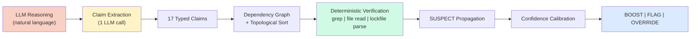

# Code Claim Verifier

**Deterministic verification of LLM claims about source code.**

LLMs reason about code and make factual assertions: "function X has no callers," "package version is 2.4.1," "this file is auto-generated." These assertions drive real decisions. But LLMs hallucinate, and nobody checks whether their claims about the code are actually true.

CCV extracts typed claims from LLM reasoning and verifies each one against the actual codebase. One LLM call for extraction. Zero LLM calls for verification. Grep doesn't hallucinate.



## Key Capabilities

- **17 claim types** across 5 categories: file/path, function/symbol, dependency, code patterns, and auth chain
- **Claim chaining** infers dependencies between claims, synthesizes missing prerequisites, and propagates refutation through the dependency graph
- **Language-aware** grep patterns for Python, Go, TypeScript, Java, C/C++, Rust
- **Batch verification** with adaptive batching and shared caches (thread-safe via contextvars)
- **Custom claim types** via registration API with extraction hints
- **CLI** with verify, verify-batch, list-types, and eval subcommands

!!! info "Evaluation results (CyberGym benchmark)"
    On 21 real-world C/C++ vulnerability repos with 2 models: **22-31% of LLM claims about code are hallucinated**. CCV achieves 99.3% verification accuracy with zero false-verified errors. On disagreements with an LLM-as-judge baseline, CCV was correct 97% of the time.

## What It Checks

| Category | Claim Types | Verification Method |
|---|---|---|
| **File/Path** | FILE_EXISTS, LINE_CONTENT, FILE_CLASSIFICATION, GENERATED_OR_VENDORED | `os.path.isfile()`, file read, path regex, header markers |
| **Function** | FUNCTION_EXISTS, FUNCTION_CALLED, HAS_CALLERS | Language-aware grep for definitions and call sites |
| **Dependency** | IMPORT_EXISTS, PACKAGE_VERSION, DEPENDENCY_TYPE, CVE_AFFECTS_VERSION | Import grep, lockfile parse |
| **Code** | ABSENCE, MITIGATION_EXISTS, ENTRY_POINT | Scoped grep (negated), file read, framework pattern grep |
| **Auth Chain** | CALL_CHAIN, DEFAULT_VALUE, CONFIG_FLAG | Multi-hop call path grep, default/nil checks, config flag grep |

## Quick Start

```bash
pip install code-claim-verifier
```

```python
from code_claim_verifier import CodeClaimVerifier

verifier = CodeClaimVerifier(llm_function=my_llm, repo_path="/path/to/repo")
report = verifier.verify(
    reasoning="torch.load() at model.py:42 has no callers in the codebase...",
    finding_file="model.py",
)

print(report.action)               # BOOST, FLAG, or OVERRIDE
print(report.verification_rate)     # 0.75
print(report.hallucination_rate)    # 0.25
```

??? example "Sample output"
    ```
    CCV extracts 3 claims:
      FILE_EXISTS(path=model.py)           -> VERIFIED  (file exists)
      FUNCTION_CALLED(name=torch.load)     -> VERIFIED  (call sites found)
      HAS_CALLERS(name=torch.load, false)  -> REFUTED   (grep found 2 callers)

    Result: 67% verified, action=FLAG
      "torch.load IS called. Re-triage."
    ```

## Verification Actions

| Rate | Action | Meaning |
|---|---|---|
| 80-100% | **BOOST** | Claims check out. Trust the LLM's conclusion. |
| 50-79% | **FLAG** | Some claims failed. Human should review. |
| <50% | **OVERRIDE** | Majority wrong. Don't trust this output. |

## Quick Links

<div class="grid cards" markdown>

-   :material-rocket-launch: **Getting Started**

    ---

    [Installation](getting-started/installation.md) and [Quick Start](getting-started/quickstart.md)

-   :material-format-list-checks: **Guides**

    ---

    [17 Claim Types](guides/claim-types.md), [Custom Types](guides/custom-types.md), [Batch Verification](guides/batch-verify.md), [CLI](guides/cli.md)

-   :material-book-open-variant: **Reference**

    ---

    [API](reference/api.md), [Claim Taxonomy](reference/claim-taxonomy.md), [Evaluation Framework](reference/eval.md)

-   :material-sitemap: **Architecture**

    ---

    [Pipeline Overview](architecture/overview.md) and [Claim Chaining](architecture/chaining.md)

</div>
