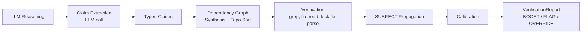

# Code Claim Verifier

**Deterministic verification of LLM claims about source code.**

When an LLM analyzes a codebase, it makes factual assertions: "this file exists," "that function is called," "this dependency is version 2.3.1." Some of those assertions are correct. Some are hallucinated. CCV tells you which is which.

## The key insight

Use the LLM for what it's good at (understanding natural language, extracting structured claims) and use deterministic tools for what they're good at (checking if a file actually exists, grepping for a function call, parsing a lockfile). Grep doesn't hallucinate.

## How it works



The pipeline has exactly **one** LLM call (extraction). Everything after that is deterministic:

1. **Extract** structured claims from the LLM's natural language reasoning
2. **Build** a dependency graph, synthesizing missing prerequisites
3. **Verify** each claim using grep, file reads, and lockfile parsing
4. **Propagate** SUSPECT flags when prerequisites are refuted
5. **Calibrate** results into a confidence score and recommended action

## What it works with

CCV is domain-agnostic. It works with any LLM output that makes assertions about source code:

- Security triage ("this function is never called from an HTTP handler")
- Code review ("the file uses torch.load without safety checks")
- Refactoring analysis ("this import is unused")
- Migration verification ("all calls to the deprecated API have been updated")
- Documentation accuracy ("the function accepts three parameters")
- Architecture assessment ("there are no direct dependencies on the database layer")

## Quick example

```python
from code_claim_verifier import CodeClaimVerifier

verifier = CodeClaimVerifier(llm_function=my_llm, repo_path="/path/to/repo")
report = verifier.verify(
    reasoning="The file utils/auth.py contains a call to hashlib.md5() on line 42.",
    domain_context="security triage",
)

print(report.action)               # BOOST, FLAG, or OVERRIDE
print(report.verification_rate)     # 0.0 to 1.0
print(report.hallucination_rate)    # 0.0 to 1.0
```

## Next steps

- [Installation](getting-started/installation.md): pip install and optional extras
- [Quick Start](getting-started/quickstart.md): verify your first LLM output in 5 minutes
- [Claim Types](guides/claim-types.md): all 14 built-in claim types
- [Architecture](architecture/overview.md): how the pipeline works under the hood
